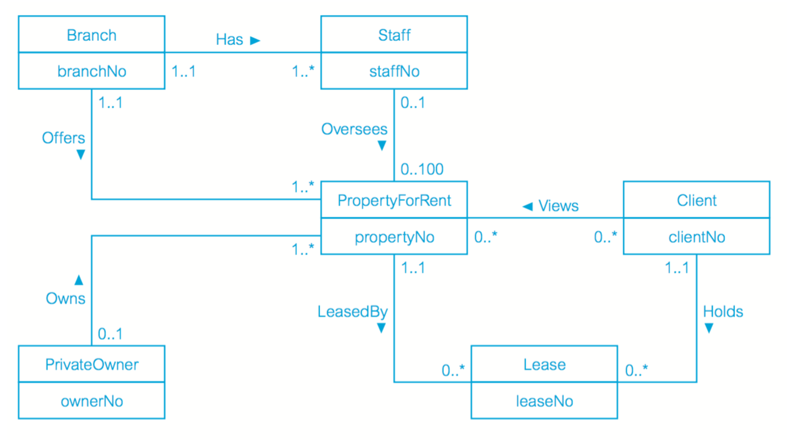

INFO 340 Relational Database Systems Notes
==========================================

Definitions
-----------
__System catalog__ (or __data dictionary__, or __metadata__) - Description of the data

__Data abstraction__ - Users of an object see only the external definition and are unaware of how the object is defined and how it functions.

__Entity__ - A distinct object. In ERD, the object encapsulates both state and behavior

__Attribute__ - A named column of a relation. A property that describes some aspect of the object (columns). Each tuple (row) contains one value per attribute.

__Relationship__ - An association between entities. Each relation has a name and is made up of named attributes of data.

__Relation__ - A 2-dimensional table with columns and rows. Elements of a relation are the tuples in the table.

__Domain__ - The set of allowable values for one or more attributes.

__Degree__ - The number of attributes a relation contains.

__Cardinality__ - The number of tuples a relation contains.

| Formal terms | Alternative 1 | Alternative 2 |
|--------------|---------------|---------------|
| Relation     | Table         | File          |
| Tuple        | Row           | Record        |
| Attribute    | Column        | Field         |

SQL Commands
------------
General Guidelines:

* Each clause in a statement should begin on a new line

* The beginning of each clause should line up with the beginning of other clauses

* If a clause has several parts, they should each appear on a separate line and be indented under the start of the clause to show the relationship

* Literals are constants. They are enclosed in single quotes. Numeric data must not be enclosed in single quotes

Simple Queries
--------------
    SELECT     [DISTINCT|ALL] {* | [columnExpression [AS newName]][,...]}
    FROM       TableName [alias][,...]
    [WHERE     condition]
    [GROUP BY  columnList] [HAVING condition]
    [ORDER BY  columnList]

columnExpression represents a column name or an expression

TableName is the name of an existing database table or view that you have access to

alias is an optional abbreviation for TableName

The sequence of processing in a SELECT statement is:

FROM        specifies the table or tables to be used

WHERE       filters the rows subject to some condition

GROUP BY    forms groups of rows with the same column value

HAVING      filters the groups subject to some condition

SELECT      specifies which columns are to appear in the output

ORDER BY    specifies the order of the output

The order in the SELECT statement cannot be changed. The only two mandatory clauses are the first two: SELECT and FROM.

Branch              (_branchNo_, street, city, postcode)

Staff               (_staffNo_, fName, lName, position, sex, DOB, salary, branchNo)

PropertyForRent     (_propertyNo_, street, city, postcode, type, rooms, rent, ownerNo, staffNo, branchNo)

Client              (_clientNo_, fName, lName, telNo, prefType, maxRent)

PrivateOwner        (_ownerNo_, fName, lName, address, telNo)

Viewing             (_clientNo_, _propertyNo_, viewDate, comment)

Registration        (_clientNo_, _branchNo_, staffNo, dateJoined)

__Example 1.1 Retrieve all columns, all rows__

    SELECT *
    FROM Staff

__Example 1.2 Retrieve specific columns, all rows__

    SELECT staffNo, fName, lName, salary
    FROM staff

__Example 1.3 Use of DISTINCT__

    SELECT propertyNo
    FROM Viewing

Could possibly show duplicates, as SELECT does not eliminate duplicates. To remove duplicates:

    SELECT DISTINCT propertyNo
    FROM Viewing

__Example 1.4 Calculated fields__

_Produce a list of monthly salaries for all staff_

    SELECT staffNo, fName, lName, salary/12
    FROM Staff

This results in an unnamed fourth column. To name it, use AS:

    SELECT staffNo, fName, lName, salary/12 AS monthlySalary
    FROM Staff

__Example 1.5 Comparison search condition__

_List all staff with a salary greater than $10,000_

    SELECT staffNo, fName, lName, position, salary
    FROM Staff
    WHERE salary > 10000

__Example 1.6 Compound comparison search condition__

_List the addresses of all branch offices in London or Glasgow_

    SELECT *
    FROM Branch
    WHERE city='London' OR city='Glasgow'

__Example 1.7 Range search condition (BETWEEN/NOT BETWEEN)__

_List all staff with a salary between $20,000 and $30,000_

    SELECT staffNo, fName, lName, position, salary
    FROM Staff
    WHERE salary BETWEEN 20000 AND 30000

__Example 1.8 Set membership search condition (IN/NOT IN)__

_List all managers and supervisors_

    SELECT staffNo, fName, lName, position
    FROM Staff
    WHERE position IN ('Manager', 'Supervisor')

__Example 1.9 Pattern match search condition (LIKE/NOT LIKE)__

_Find all owners with the string 'Glasgow' in their address_

% character represents any sequence of zero or more characters (wildcard)

_ character represents any single character

You can define the escape character: 
    
    LIKE '15#%' ESCAPE '#'

__Example 1.10 NULL search condition (IS NULL/IS NOT NULL)__

_List the details of all viewings on property PG4 where a comment has not been supplied_

    SELECT clientNo, viewDate
    FROM Viewing
    WHERE propertyNo = 'PG4' AND comment IS NULL

__Example 1.11 Single-column ordering__

_Order by salary in descending order_

    SELECT staffNo, fName, lName, salary
    FROM Staff
    ORDER BY salary DESC

__Example 1.12 Multiple-column ordering__

_Order by type in ascending order, then rent in descending order_

    SELECT propertyNo, type, rooms, rent
    FROM PropertyForRent
    ORDER BY type, rent DESC

SQL Aggregate Functions
-----------------------
COUNT - returns the number of values in a specified column

SUM - returns the sum of the values in a specified column

AVG - returns the average of the values in a specified column

MIN - returns the smallest value in a specified column

MAX - returns the largest value in a specified column

__Example 1.13 Use of COUNT(*)__

Examples
--------
List all flats with a monthly rent greater than $400:

    SELECT *
    FROM PropertyForRent
    WHERE type = 'Flat' AND rent > 400

__Simple Table Query__

    SELECT *
    FROM [Person].[Person] P

_P is like a variable name for the table object_

