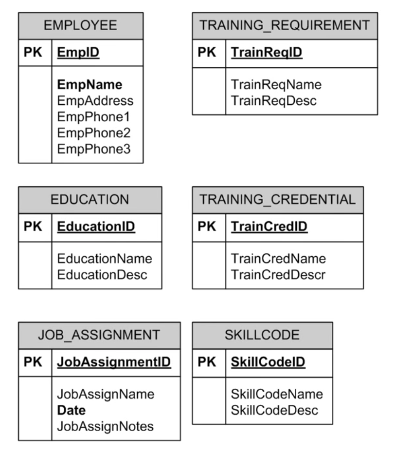
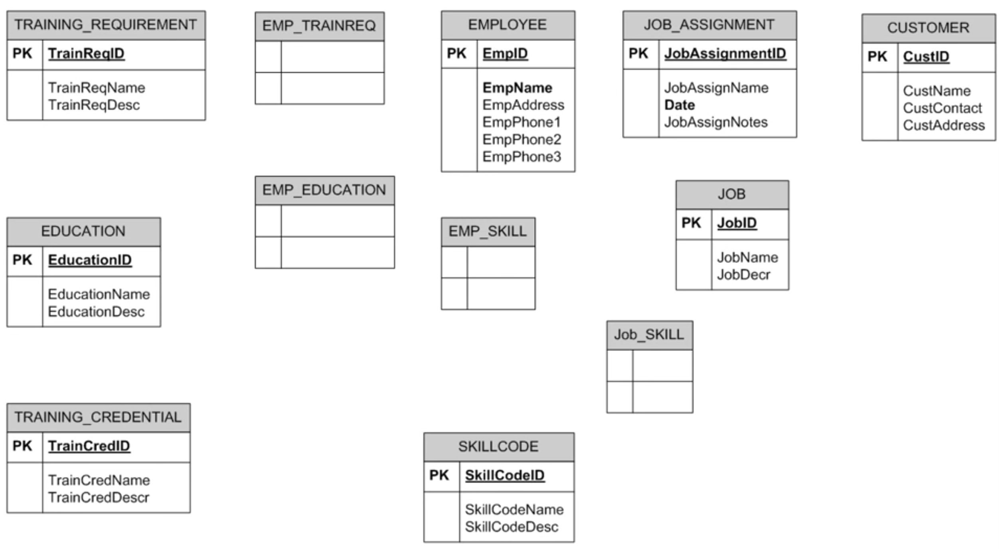
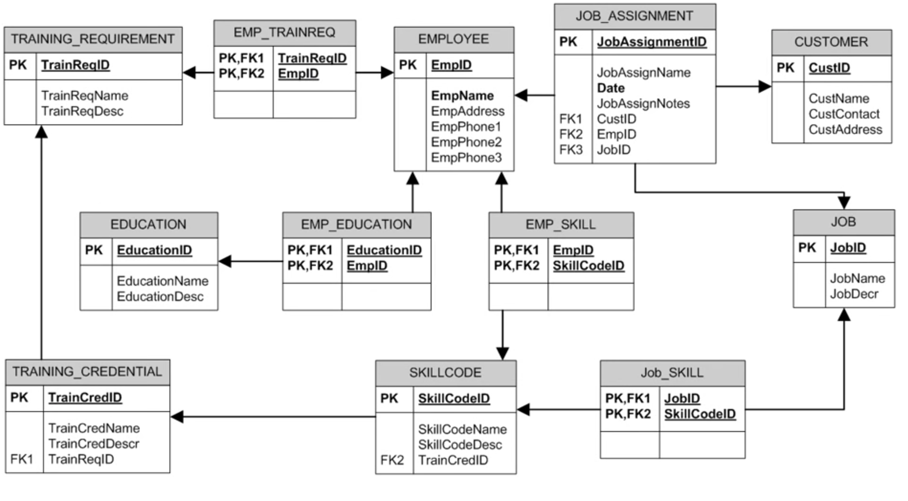

Conceptual Design Example 1
===========================
[Lecture](https://www.youtube.com/watch?v=7lM2-H7dCd0&list=PLGFwlRazZzkT0UiXd5mRB6SAyJ2_rCc0n&index=7)

A company needs a database to track the employees and their training requirements as well as their education and training credentials against their job assignments and skill code classification.

Look for the 'Nouns'
--------------------

Create obvious nouns for initial batch of entities.

A company needs a database to track the _employees_ and their _training requirements_ as well as their _education_ and _training credentials_ against their _job assignments_ and _skill code classification_.

Look at relationships between entities
--------------------------------------
1. Create more entities to support requirements

2. Find associative entities from M:M relationships

3. Align entities that relate to each other

4. Fine-tuning as needed

Creating more entities
----------------------
What other 'nouns' may be created?

__Job Assignments__ 

_Who/what is involved?_

* Employee
* Job
* Customer
* Materials/Products
* Service

Find associative entities (M:M relationships)
---------------------------------------------
- __EMPLOYEE__ and __EDUCATION__

- __EMPLOYEE__ and __SKILL__

- __EMPLOYEE__ and __TRAINING_REQUIREMENT__

- __JOB__ and __SKILL__

Defining relationships
----------------------

- __EMPLOYEE__ has a relationship with __JOB_ASSIGNMENT__
    - Completes

- __JOB__ has a relationship with __JOB_ASSIGNMENT__
    - Recieves

- __JOB_ASSIGNMENT__ has a relationship with __SKILL__
    - Requires

- __SKILL__ has a relationship with __TRAINING_CREDENTIAL__
    - Requires

- __EMPLOYEE__ has a relationship with __EDUCATION__
    - Has

- __TRAINING_CREDENTIAL__ has a relationship with __TRAINING_REQUIREMENT__
    - Includes

