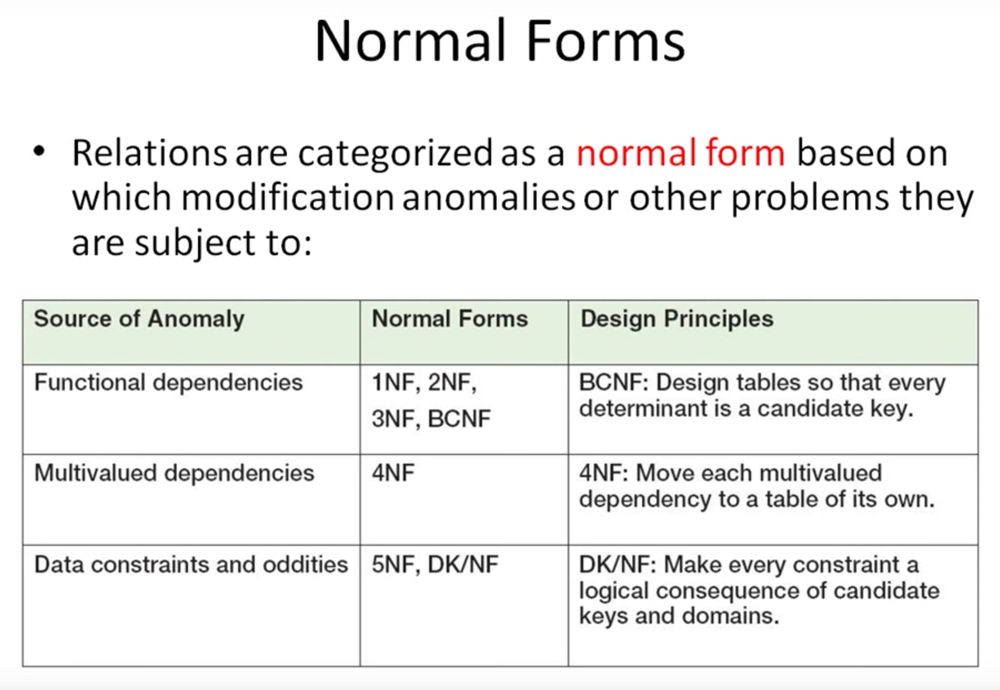

Normalization
=============

__UNF__ - a table that has repeating groups of column values

__1NF__ - a table that qualifies as a relation

__2NF__ - a relation where all of its non-key attributes are dependent on _all_ of the primary keys

__3NF__ - a relation where it is in 2NF and has _no determinants except the primary key_

__Boyce-Code Normal Form (BCNF)__ - a relation where every determinant is a candidate key

Unnormalized Form (UNF)
-----------------------

A table that contains one/more repeating groups

To create an unnormalized table:

- Transform the data from the information source into table format with columns and rows 

- E.g. multiple rows for collection of phone #s.

- All other columns must repeat

First Normal Form (1NF)
-----------------------

A relation in which the intersection of each row and column contains one and only one value

- E.g. Phone1, Phone2, Phone3

UNF to 1NF
----------

Nominate an attribute or group of attributes to act as the key for the unnormalized table. Identify repeating group(s) in the unnormalized table which repeats for the key attributes(s).

Remove the repeating group by:

- Entering appropriate data into empty columns of rows containing repeating data ('flattening' the table)

- Placing the repeating data along with a copy of the original key attribute(s) into a new table

- We will eventually need to create a new table

Second Normal Form (2NF)
------------------------

A relation in 1NF and every non-primary-key attribute is fully functionally dependent on the primary key

Based on concept of full functional dependency

Full functional dependency indicates that if 

- A and B are attributes of a relation

- B is fully dependent on A if B is functionally dependent on A but not on any proper subset of A

